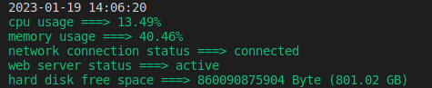

<div align="center">
    <p>
        <h1> Stethoscope <br/>For listening to your Laravel app server heartbeat</h1>
    </p>
</div>

<p align="center">
    <a href="#features">Features</a> |
    <a href="#installation">Installation</a> |
    <a href="#usage">Usage</a> |
    <a href="#dashboard">Dashboard</a> |
    <a href="#configuration">Configuration</a> |
    <a href="#testing">Testing</a> |
    <a href="#changelog">Changelog</a> |
    <a href="#contributing">Contributing</a> |
    <a href="#credits">Credits</a> |
    <a href="#license">License</a>
</p>

<p align="center">
    <a href="https://packagist.org/packages/mohsenabrishami/stethoscope">
        
    </a>
    <a href="https://packagist.org/packages/mohsenabrishami/stethoscope">
        
    </a>
    <a href="https://packagist.org/packages/mohsenabrishami/stethoscope">
        
    </a>
    <a href="https://packagist.org/packages/mohsenabrishami/stethoscope">
        
    </a>
    <a href="https://scrutinizer-ci.com/g/MohsenAbrishami/stethoscope">
        
    </a>
</p>

This Laravel package allows you to monitor the infrastructure.

With this package, You can check your server health at any time.

## Features

- Monitoring CPU usage percentage

- Monitoring memory usage percentage

- Monitoring hard disk free space

- Checking the network connection status

- Checking web Server status (Nginx/Apache)

- Recording log when CPU, memory, and hard disk usage exceeds the specified threshold

- Recording log when the network connection fails or the web server deactivated

- Sending email when a problem occurs in the CPU, memory, hard disk, web server, and network of server


Do you need more options? you can make an issue or contributes to the package

## Get Started

### Requirements
- **PHP 8.0+**
- **Laravel 8+**
- **Linux Operating System (Debian, Ubuntu, mint, ...)**

### Installation

This package requires PHP 8.0 and Laravel 8.0 or higher.
You can install the package via composer:

``` bash
composer require mohsenabrishami/stethoscope
```

and then run:

``` bash
php artisan vendor:publish --tag=stethoscope-publish-config
```

Stethoscope allows you to record reports both in a file and in a database. 
If you set the database driver in the config file, you must run migrate command:

``` bash
php artisan migrate
```

## Usage

Once installed, see your server health details with a command:

``` bash
php artisan stethoscope:listen
```

The output will be like this:

<div align="center">
    <br />
</div>

But the work of this package didn't stop there. you can set thresholds for CPU, memory and hard disk consumption. if CPU and memory consumption exceeds thresholds or hard disk free space is less than thresholds, then a log is created from details consumption. also, you can config this package so that if the deactivated web server or disconnected internet log is created. To start monitoring your server, just run this command:

``` bash
php artisan stethoscope:monitor
```

You can monitor your server constantly with the run this command by a cron job.
You may want to be notified if there is a problem in the server. For this, it is enough to set your email admin in the config file.

If you are worried about the increase in logs, use the following command. This command deletes old logs based on the number of days you defined in the config file.

``` bash
php artisan stethoscope:clean
```

## Dashboard
Stethoscope provides a dashboard where you can easily see the current status of the server at any time. Also, in this dashboard, you can see a history of the times when resource consumption exceeded the limit or when the network and web server were disabled.


If you use the monitoring panel, you must publish the build files:

``` bash
php artisan vendor:publish --tag=stethoscope-publish-view
```

Remember that the monitoring dashboard is disabled by default. To activate, you must set monitoring_panel.status to true in config file. Also, the log storage driver must be a database, not a file.

You can put a key to access the admin panel. If you define a key, you can access the dashboard only when you enter the key in the address.

you can access this panel with address https://yoursite/monitoring-panel?key=sampletoken
```php
/*
| Here, you can specify whether the monitoring panel is enabled and the key required to access it.
*/
'monitoring_panel.status' => false,
'monitoring_panel_key' => env('MONITORING_PANEL_KEY')
```
## Configuration

You can easily customize this package in the config/stethoscope.php.

In this file, You can configure the following:

- Resources that should be monitored. We can monitor the CPU, memory, hard disk, network connection, and web server status.

- Web server that is installed on your server. We support Nginx and apache.

- Storage driver and path to saving log files.

- Resources Thresholds. Include maximum CPU and memory usage and minimum hard disk space.

- Custom network URL for network connection monitor.

- Driver to save resource logs (support file storage and database).

- Emails address to send notification emails when your server has problems.

- Number of days for which resource logs must be kept.

By default, the configuration looks like this:

```php
    /*
    |--------------------------------------------------------------------------
    | Monitorable Resources
    |--------------------------------------------------------------------------
    | Here you can Define which resources should be monitored.
    | Set true if you want a resource to be monitored, otherwise false.
    |
    */

    'monitorable_resources' => [
        'cpu' => true,
        'memory' => true,
        'hard_disk' => true,
        'network' => true,
        'web_server' => true,
    ],

    /*
    |--------------------------------------------------------------------------
    | Web Server Name
    |--------------------------------------------------------------------------
    | Here you can define what web server installed on your server.
    | Set `nginx` or `apache`
    |
    */

    'web_server_name' => 'nginx',

    /*
    |--------------------------------------------------------------------------
    | Log File Storage
    |--------------------------------------------------------------------------
    | Define storage driver and path for save log file.
    |
    */

    'log_file_storage' => [
        'driver' => 'local',
        'path' => 'stethoscope/',
    ],

    /*
    |--------------------------------------------------------------------------
    | Thresholds
    |--------------------------------------------------------------------------
    | If resource consumption exceeds these thresholds, a log will be created.
    | You may define maximum CPU and memory usage by percent.
    | You may define minimum hard disk space by byte.
    */

    'thresholds' => [

        'cpu' => env('CPU_MONITOR_THRESHOLD', 90),

        'memory' => env('MEMORY_MONITOR_THRESHOLD', 80),

        'hard_disk' => env('HARD_DISK_MONITOR_THRESHOLD', 5368709),

    ],

    /*
    |--------------------------------------------------------------------------
    | Network Monitor URL
    |--------------------------------------------------------------------------
    | Here you can define the desired URL for network monitoring.
    |
    */

    'network_monitor_url' => env('NETWORK_MONITOR_URL', 'https://www.google.com'),

    /*
    |--------------------------------------------------------------------------
    | Log Record Driver
    |--------------------------------------------------------------------------
    | Set `database` for save logs in database and `file` for record logs in file
    |
    */

    'drivers' => [
        'log_record' => env('STETHOSCOPE_LOG_DRIVER'  ,'file')
    ]

    /*
    |
    | You can get notified when specific events occur. you should set an email to get notifications here.
    |
    */

    'notifications' => [
        'mail' => [
            'to' => null,
        ],
    ],

    /*
    |
    | Here you define the number of days for which resource logs must be kept.
    | Older resource logs will be removed.
    |
    */

    'cleanup_resource_logs' => 7,

    /*
    |
    | Here, you can specify whether the monitoring panel is enabled and the key required to access it.
    | Also, you can customize the monitoring panel path.
    |
    */
    'monitoring_panel' =>
    [
        'status' => false,
        'path' => 'monitoring-panel',
        'key' => env('MONITORING_PANEL_KEY'),
    ]
```

## Testing
Run the tests with:

```php
composer test
```
## Changelog

Please see [CHANGELOG](CHANGELOG.md) for more information on what has changed recently.

## Contributing

Please see [CONTRIBUTING](CONTRIBUTING.md) for details.

## Credits

- [Mohsen Abrishami](https://github.com/mohsenabrishami)

## License

The MIT License (MIT). Please see [License File](LICENSE.md) for more information.
